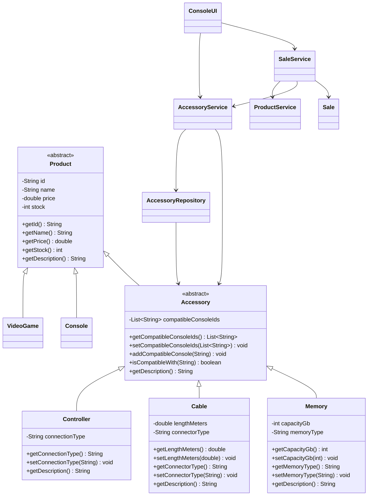

# Accessory Class Diagram

The compatibility relation is represented by `Accessory.compatibleConsoleIds`, which stores console identifiers rather than direct console objects. This keeps the model independent from persistence and avoids introducing a repository dependency into the model layer.
