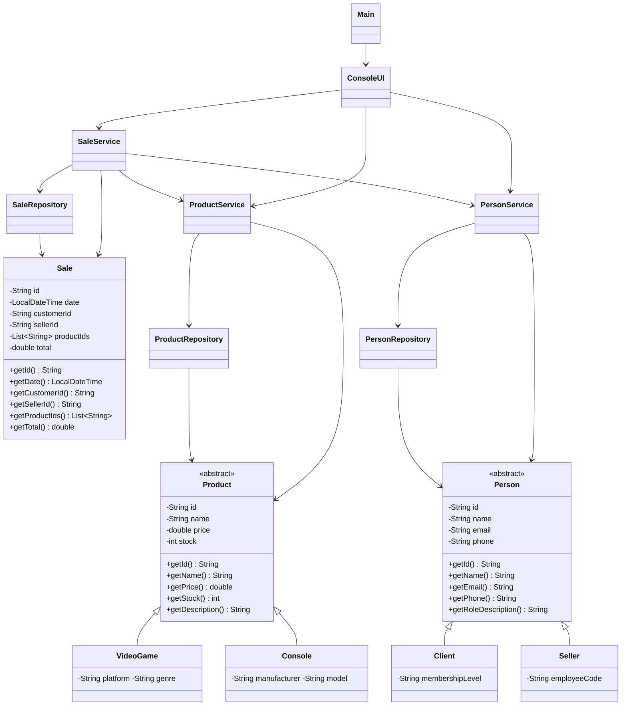

# Class Diagram

```mermaid
classDiagram
    class Person {
        <<abstract>>
        -String id
        -String name
        -String email
        -String phone
        +getId() String
        +getName() String
        +getEmail() String
        +getPhone() String
        +getRoleDescription() String
    }
    class Client { -String membershipLevel }
    class Seller { -String employeeCode }
    Person <|-- Client
    Person <|-- Seller

    class Product {
        <<abstract>>
        -String id
        -String name
        -double price
        -int stock
        +getId() String
        +getName() String
        +getPrice() double
        +getStock() int
        +getDescription() String
    }
    class VideoGame { -String platform -String genre }
    class Console { -String manufacturer -String model }
    Product <|-- VideoGame
    Product <|-- Console

    class Sale {
        -String id
        -LocalDateTime date
        -String customerId
        -String sellerId
        -List~String~ productIds
        -double total
        +getId() String
        +getDate() LocalDateTime
        +getCustomerId() String
        +getSellerId() String
        +getProductIds() List~String~
        +getTotal() double
    }

    class ProductRepository
    class PersonRepository
    class SaleRepository
    class ProductService
    class PersonService
    class SaleService
    class ConsoleUI
    class Main
    ProductRepository --> Product
    PersonRepository --> Person
    SaleRepository --> Sale
    ProductService --> ProductRepository
    ProductService --> Product
    PersonService --> PersonRepository
    PersonService --> Person
    SaleService --> SaleRepository
    SaleService --> Sale
    SaleService --> ProductService
    SaleService --> PersonService
    ConsoleUI --> ProductService
    ConsoleUI --> PersonService
    ConsoleUI --> SaleService
    Main --> ConsoleUI
```
