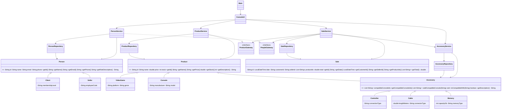

# Class Diagram

```mermaid
classDiagram
    class Person { <<abstract>> -String id -String name -String email -String phone +getId() String +getName() String +getEmail() String +getPhone() String +getRoleDescription() String }
    class Client { -String membershipLevel }
    class Seller { -String employeeCode }
    Person <|-- Client
    Person <|-- Seller

    class Product { <<abstract>> -String id -String name -double price -int stock +getId() String +getName() String +getPrice() double +getStock() int +getDescription() String }
    class VideoGame { -String platform -String genre }
    class Console { -String manufacturer -String model }
    class Accessory { <<abstract>> -List~String~ compatibleConsoleIds +getCompatibleConsoleIds() List~String~ +addCompatibleConsole(String) void +isCompatibleWith(String) boolean +getDescription() String }
    class Controller { -String connectionType }
    class Cable { -double lengthMeters -String connectorType }
    class Memory { -int capacityGb -String memoryType }
    Product <|-- VideoGame
    Product <|-- Console
    Product <|-- Accessory
    Accessory <|-- Controller
    Accessory <|-- Cable
    Accessory <|-- Memory

    class Sale { -String id -LocalDateTime date -String customerId -String sellerId -List~String~ productIds -double total +getId() String +getDate() LocalDateTime +getCustomerId() String +getSellerId() String +getProductIds() List~String~ +getTotal() double }
    class ProductRepository
    class PersonRepository
    class SaleRepository
    class AccessoryRepository
    class ProductService
    class PersonService
    class SaleService
    class AccessoryService
    class ProductGateway { <<interface>> }
    class PeopleGateway { <<interface>> }
    class ConsoleUI
    class Main

    ProductService ..|> ProductGateway
    PersonService ..|> PeopleGateway
    ProductRepository --> Product
    PersonRepository --> Person
    SaleRepository --> Sale
    AccessoryRepository --> Accessory
    ProductService --> ProductRepository
    ProductService --> Product
    PersonService --> PersonRepository
    PersonService --> Person
    AccessoryService --> AccessoryRepository
    AccessoryService --> Accessory
    SaleService --> SaleRepository
    SaleService --> Sale
    SaleService --> ProductGateway
    SaleService --> PeopleGateway
    SaleService --> AccessoryService
    ConsoleUI --> ProductService
    ConsoleUI --> AccessoryService
    ConsoleUI --> PersonService
    ConsoleUI --> SaleService
    Main --> ConsoleUI
```
