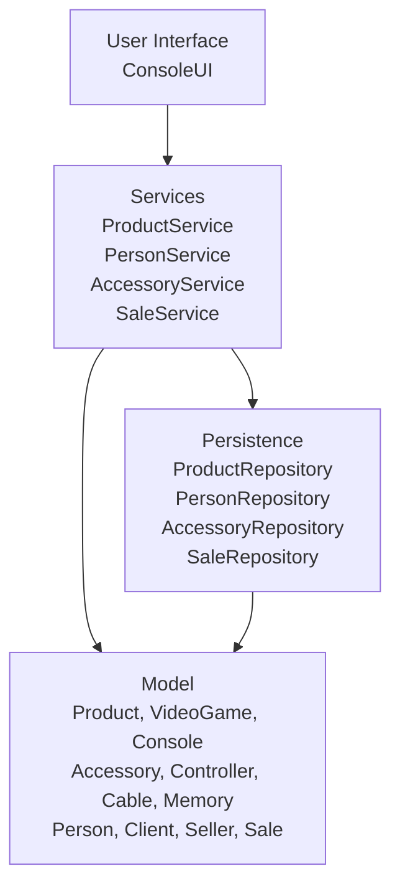

# Layers Diagram

```mermaid
flowchart TB
    UI[User Interface<br/>ConsoleUI]
    S[Services<br/>ProductService<br/>PersonService<br/>AccessoryService<br/>SaleService]
    P[Persistence<br/>ProductRepository<br/>PersonRepository<br/>AccessoryRepository<br/>SaleRepository]
    M[Model<br/>Product, VideoGame, Console<br/>Accessory, Controller, Cable, Memory<br/>Person, Client, Seller, Sale]
    UI --> S
    S --> P
    S --> M
    P --> M
```
